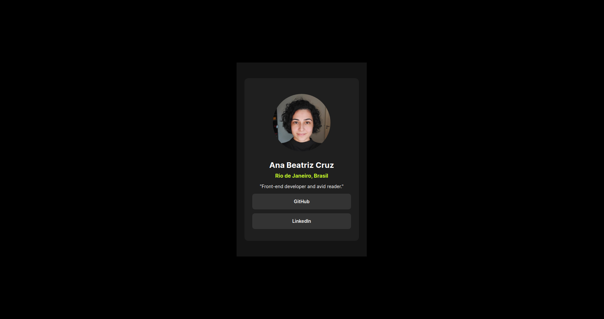
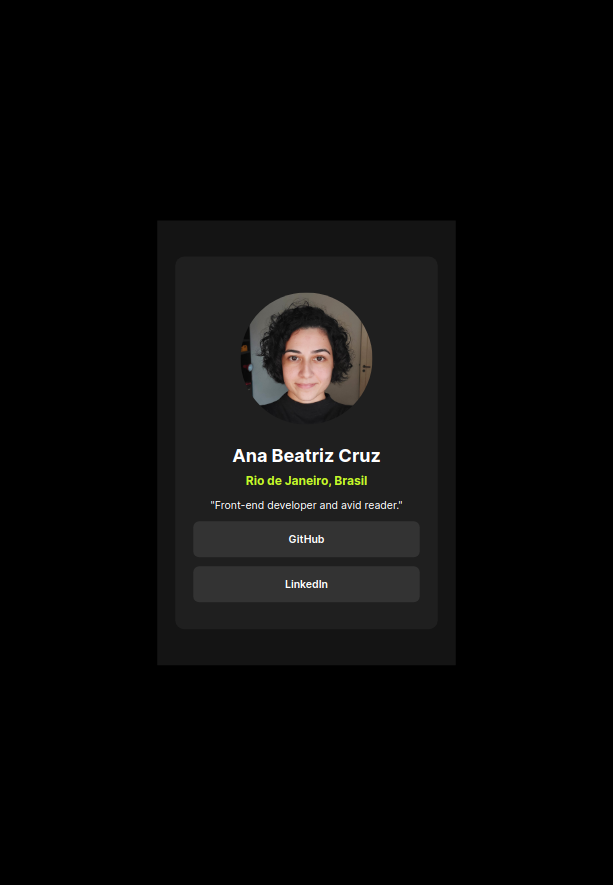
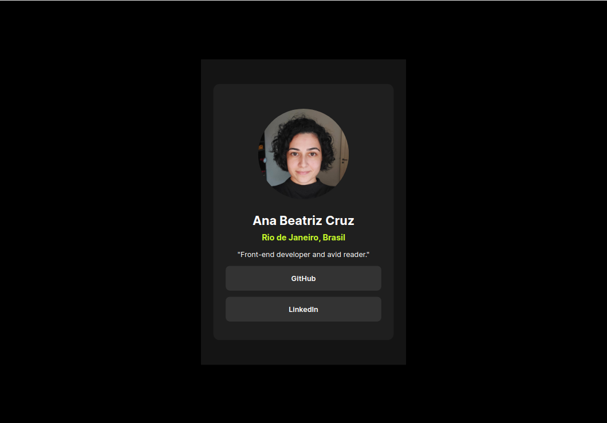
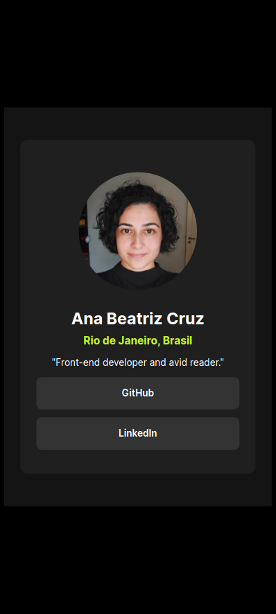

# Frontend Mentor - Social links profile solution

This is a solution to the [Social links profile challenge on Frontend Mentor](https://www.frontendmentor.io/challenges/social-links-profile-UG32l9m6dQ).

## Table of contents

- [Overview](#overview)
  - [The challenge](#the-challenge)
  - [Screenshot](#screenshot)
  - [Links](#links)
- [My process](#my-process)
  - [Built with](#built-with)
  - [What I learned](#what-i-learned)
- [Author](#author)

**Note: Delete this note and update the table of contents based on what sections you keep.**

## Overview

### The challenge

Users should be able to:

- See hover and focus states for all interactive elements on the page
- Have friendly navigation in mobile devices

### Screenshot

#### Desktop


#### Tablet



### Mobile


### Links

- [Live Site URL](https://anabscruz.github.io/my-social-links-profile/)

## My process

### Built with

- Semantic HTML5 markup
- CSS custom properties
- CSS variables
- CSS animation
- Flexbox

### What I learned
Some colors are used repeatedly. Therefore, I thought it would be a good idea to declare css variables for colors.
```css
:root {
    --Green: hsl(75, 94%, 57%);
    --White: hsl(0, 0%, 100%);
    --Grey: hsl(0, 0%, 20%);
    --Dark-grey: hsl(0, 0%, 12%);
    --Off-black: hsl(0, 0%, 8%);
    --Black: hsl(0,0%,0%);
}

body {
    background-color: var(--Black);
    color: var(--White);
}
```

In order to apply focus style with smooth transition, I used animation.
```css
@keyframes change-color {
    from {
        background-color: var(--Grey);
        color: var(--White);
    }
    to {
        background-color: var(--Green);
        color: var(--Off-black);
    }
}

div.container>div.content>a:hover, div.container>div.content>a:focus{
    background-color: var(--Green);
    color: var(--Off-black);
    outline: none;
    animation: change-color;
    animation-duration: 0.5s;
}
```

## Author

- Website - [Ana Beatriz Cruz S. Ribeiro](https://anabscruz.github.io/my-social-links-profile/)
- Frontend Mentor - [@anabscruz](https://www.frontendmentor.io/profile/anabscruz)
